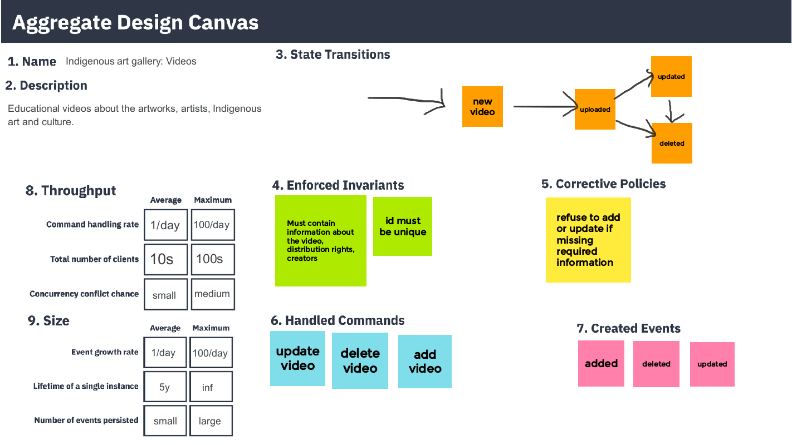
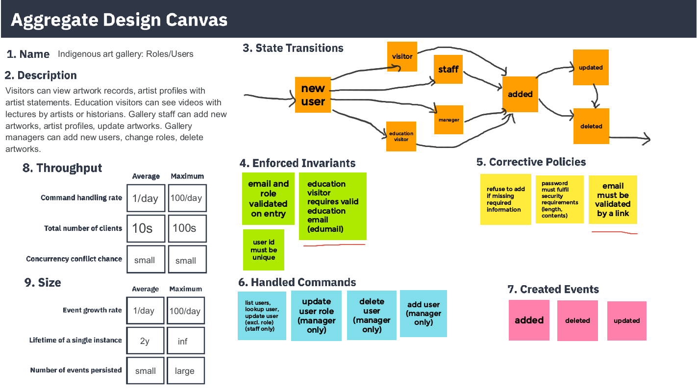

# art-gallery-api

## Project Summary
* Web API stack: Django REST framework
* DB engine: MongoDB accessed through Djongo (SQL mapper)
* Complex documentation available through Swagger, built with drf-spectacular
* A customised admin site allows easy interaction with the database
* Business requirements documents were fully completed for each application within the API
* A custom user allows for permissions extensions according to the business requirements document with messages based on the action, e.g.

[Demo video](https://youtu.be/sc4Olc10wkM)

Included in this repository is the [JSON](./art-gallery.postman_test_run.json) of my postman run demonstrating interaction with the
endpoints, the VS code folder, and images of the business documents.

